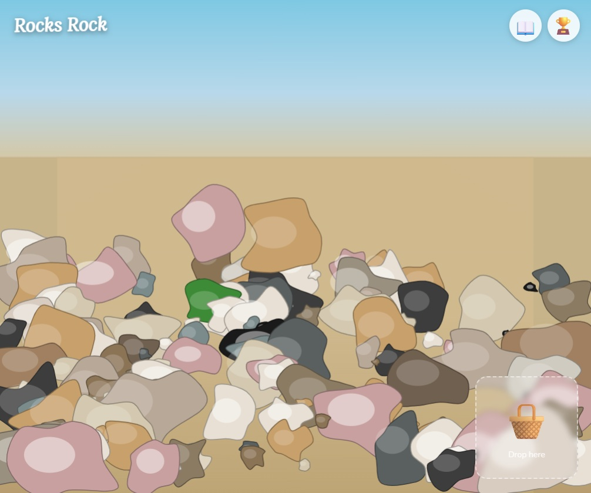
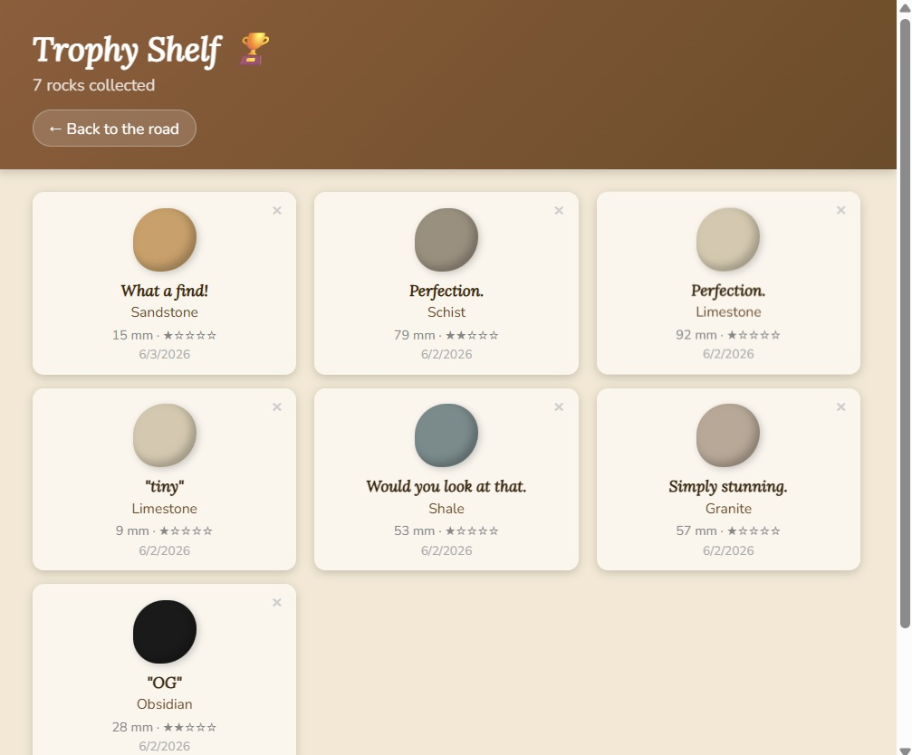
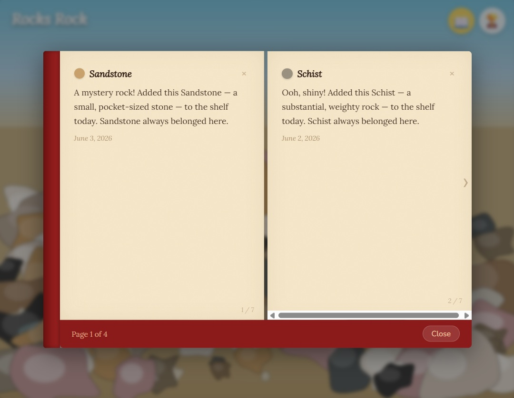

# Rocks Rock 🪨

A communal, browser-based rock-collecting experience. Walk a procedurally generated rocky road, examine real-world rock types, drag them into your basket, name them, and add them to a shared trophy shelf and field journal.

---

## User Guide



### The Road View
- **Hover** over a rock to see its name, size, and rarity.
- **Click and hold** (300 ms) to inspect full collector details: hardness, luster, texture, and a fun fact.
- **Drag** a rock to the wicker basket in the lower-right corner to collect it.
- After dropping a rock, a naming dialog appears. Type a nickname or click **Skip**.
- Rocks reset every **24 hours** — a fresh batch appears at midnight.

<br>


### The Trophy Shelf (🏆)
- Click the trophy icon in the upper right to browse all collected rocks.
- Rocks are sorted newest-first on warm wooden shelves.
- Click the small **×** on any rock card to remove it from the shelf.

<br>


### The Journal (📖)
- Click the book icon in the upper right to open the field journal.
- Each collected rock gets one auto-generated journal entry.
- Click the **›** and **‹** arrows on the page edges to flip through entries.
- Click the small **×** on a journal page to delete that entry (and its shelf rock).

### Rules
- The shelf holds a maximum of **300 rocks** at a time (communal cap).
- Rock names are filtered for profanity — keep it friendly.
- Rock rarity follows real-world geology: quartz is everywhere, diamonds are not.

---

## Developer Guide

### Architecture

```
rocks-rock/
├── backend/   Express.js API + SQLite — serves rocks, shelf, journal
└── frontend/  React + Vite + Konva canvas — renders the experience
```

**Backend** follows MVC:
- `src/data/rockTypes.ts` — static rock species catalog (seeded once)
- `src/models/db.ts` — SQLite singleton + schema bootstrap
- `src/services/` — rock generator, profanity filter, daily scheduler
- `src/controllers/` — request handlers (rocks, shelf, journal)
- `src/routes/index.ts` — URL → controller mapping

**Frontend** data flow:
- Konva `Stage` renders the full-viewport canvas scene
- React hooks (`useRoadRocks`, `useShelf`) fetch and cache API data
- All state is lifted to `App.tsx`; canvas and DOM overlays are siblings

### Stack

| Layer | Tech |
|---|---|
| Frontend | React 18, TypeScript, Vite, react-konva (Konva.js) |
| Backend | Node.js, Express 4, TypeScript, better-sqlite3 |
| Database | SQLite (local dev) → swap `DB_PATH` for Supabase/Postgres later |
| Testing | Backend: Jest + ts-jest + supertest · Frontend: Vitest + Testing Library |

### Local Setup

**Requirements:** Node 18+

```bash
# 1. Install dependencies
cd backend && npm install
cd ../frontend && npm install

# 2. Start the backend (dev mode with auto-reload)
cd backend
cp .env.example .env       # edit DB_PATH, PORT if needed
npm run dev                # listens on http://localhost:3001

# 3. Start the frontend (in a separate terminal)
cd frontend
npm run dev                # opens http://localhost:5173
```

The Vite dev server proxies `/api/*` → `localhost:3001` automatically.  
The backend seeds rock types and generates road rocks on first startup.

### Running Tests

```bash
# Backend (Jest)
cd backend && npm test

# Frontend (Vitest)
cd frontend && npm test

# Vitest with interactive UI
cd frontend && npm run test:ui
```

### API Reference

| Method | Path | Description |
|---|---|---|
| `GET` | `/api/rocks` | All uncollected road rocks (with type data) |
| `POST` | `/api/rocks/:id/collect` | Mark a rock as collected |
| `GET` | `/api/shelf` | All shelf rocks, newest first |
| `POST` | `/api/shelf` | Add collected rock to shelf (body: `{ roadRockId, rockTypeId, sizeMm, nickname? }`) |
| `DELETE` | `/api/shelf/:id` | Remove shelf rock (cascades to journal) |
| `GET` | `/api/journal` | All journal entries, newest first |
| `DELETE` | `/api/journal/:id` | Delete journal entry (cascades to shelf rock) |
| `GET` | `/health` | Health check |

### Environment Variables (backend `.env`)

| Variable | Default | Description |
|---|---|---|
| `PORT` | `3001` | HTTP port |
| `DB_PATH` | `./rocks.db` | SQLite file path (use `:memory:` for tests) |
| `ROAD_ROCK_COUNT` | `150` | Rocks generated per 24h cycle |
| `FRONTEND_ORIGIN` | `http://localhost:5173` | CORS allow-list |

### Adding Rock Types

Edit `backend/src/data/rockTypes.ts`. Add an entry to the `ROCK_TYPES` array following the existing schema. The `spawnWeight` controls how often the rock appears relative to all others — higher is more common. Delete the `rocks.db` file and restart to re-seed.

### Deployment Checklist (v2)

- [ ] Swap SQLite for Supabase (Postgres) — only `db.ts` needs changes
- [ ] Deploy backend to Render (point `DB_PATH` or connection string at Supabase)
- [ ] Deploy frontend to Netlify (set `VITE_API_URL` to Render backend URL)
- [ ] Set `FRONTEND_ORIGIN` env var on Render to the Netlify domain
- [ ] Increase `ROAD_ROCK_COUNT` to 4,000 and add canvas virtualization

### Known Limitations (MVP)

- **No real-time sync** — rocks picked up by other users disappear on your next page refresh, not instantly.
- **Fixed viewport** — no scrollable panoramic road yet (v2).
- **Basket is a visual target only** — it doesn't accumulate rocks; the naming modal fires immediately on drop.
- **No auth** — the shelf is communal and anyone can delete anyone's rock.

---

## License

MIT
